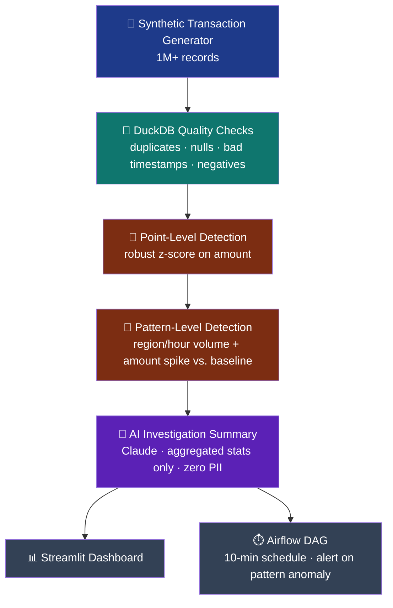

<div align="center">


<br/>


</div>

---

## ⚡ What This Is

> Every row below is **100% synthetic**. No real banking, customer, or financial data is used anywhere in this project.

This pipeline generates **1M+ synthetic financial transactions**, runs them through DuckDB-powered data-quality checks, then layers **two independent anomaly detectors** on top:

- 🔍 **Point-level** — robust z-score outliers on individual transaction amounts
- 📊 **Pattern-level** — region/hour volume-and-amount spikes vs. baseline

...to surface a **coordinated fraud-style burst**, then hands only *aggregated, non-PII statistics* to Claude to write a plain-English investigation summary.

<div align="center">

</div>

## 🧠 The Problem

Financial systems have to process huge transaction volumes while catching two very different kinds of trouble:

| | |
|---|---|
| 🧹 **Data quality issues** | duplicate IDs, missing fields, malformed timestamps |
| 🚨 **Behavioral anomalies** | a burst of high-value transactions concentrated in one region and time window — the kind of signal that precedes a fraud investigation |

This project builds a measurable, reproducible pipeline for catching both.

## 🧬 Data Source (Synthetic, Seeded, Measurable)

`ingestion/generate_transactions.py` builds **1,000,000+ transactions** — `customer_id`, `amount`, `timestamp`, `merchant`, `region`, `currency` — with a right-skewed amount distribution, then *deliberately* injects:

```
✗  duplicate transaction IDs
✗  NULL amounts / merchants
✗  invalid, future-dated timestamps
✗  a handful of extreme / negative amounts
✗  a 700-transaction fraud-style burst
     └─ concentrated in ONE region (TX) + ONE hour window
     └─ amounts $800–3000 vs. a normal mean of ~$90
```

Because the ground truth is *known and seeded*, detection accuracy can be measured objectively instead of eyeballed.

<details>
<summary>📋 <b>Data Dictionary</b> (click to expand)</summary>

<br/>

| Column | Type | Description |
|---|---|---|
| `transaction_id` | int | Unique transaction identifier |
| `customer_id` | int | Synthetic customer identifier |
| `amount` | float | Transaction amount |
| `timestamp` | datetime | Transaction time |
| `merchant` | string | One of 50 synthetic merchants |
| `region` | string | US state code |
| `currency` | string | Mostly USD, a few EUR/GBP/CAD |

</details>

## 🏗️ Architecture



## 🛠️ Technology Stack

<div align="left">


</div>

## 📁 Pipeline Flow

| File | Responsibility |
|---|---|
| `ingestion/generate_transactions.py` | Generates 1M+ transactions with injected quality issues + seeded fraud burst |
| `quality/checks.py` | DuckDB checks for duplicates, nulls, invalid timestamps, negative amounts |
| `processing/anomaly.py` | Robust z-score point detection + region/hour pattern detection |
| `ai/explain.py` | Generates an investigation summary from aggregated statistics only |
| `run_pipeline.py` | Orchestrates steps 1–4, measures throughput, writes `data/anomaly_report.json` |
| `dashboard/app.py` | Visualizes quality metrics and anomalies |
| `dags/financial_anomaly_dag.py` | Reference Airflow scheduling + alerting design |

## ✅ Data Quality Rules

| Check | Method |
|---|---|
| Duplicates | `COUNT(*) - COUNT(DISTINCT transaction_id)` |
| Nulls | NULL count on `amount`, `merchant` |
| Invalid timestamps | `timestamp > '2026-12-31'` (future-dated) |
| Negative amounts | `amount < 0` |

## 🤖 AI Component — Privacy by Design

`ai/explain.py` receives **only** aggregated quality metrics and anomaly statistics — counts, ratios, region/hour buckets — **never raw transaction-level records** — and asks Claude for a concise investigation summary and recommended next action.

```
┌─────────────────────────────────────────────┐
│  What Claude sees:        What Claude never  │
│  ✓ duplicate counts       sees:               │
│  ✓ null ratios            ✗ customer_id       │
│  ✓ region/hour buckets    ✗ raw amounts       │
│  ✓ volume/amount ratios   ✗ merchant names    │
│                           ✗ timestamps         │
└─────────────────────────────────────────────┘
```

This mirrors how a real deployment would need to keep PII/PCI-scoped data out of third-party API calls. Falls back to a deterministic template when no API key is configured.

## 🧪 Testing Strategy

```bash
pytest tests/ -v
```

| # | Test | Result |
|---|---|:---:|
| 1 | Quality checks detect all 4 injected issue types | ✅ |
| 2 | Point-level detection flags only genuinely extreme values (z-score > 6) | ✅ |
| 3 | Pattern-level detection finds the seeded fraud burst (volume ratio > 3x **and** amount ratio > 3x) | ✅ |

## 📈 Performance Results *(actually measured, not estimated)*

<div align="center">

| Metric | Value |
|---|---|
| **Transactions processed** | 1,005,000 end-to-end |
| **Runtime** | ~1.5 seconds |
| **Throughput** | ≈ 668K–1.2M records/sec |
| **Duplicate IDs caught** | 5,000 |
| **Null amounts caught** | 3,014 |
| **Invalid timestamps caught** | 1,005 |
| **Point-level outliers flagged** | 2,018 |

</div>

**Pattern-level detection — the headline result:**

> 🚨 Correctly identified the single seeded fraud burst — **TX, 2026-08-15 02:00** — **856 transactions** (**4.9x** baseline volume), average amount **$1,550** (**17.0x** baseline) — with **zero false-positive** pattern windows anywhere else in the dataset.

*Exact numbers reproducible in `data/anomaly_report.json` — see [How to Run](#-how-to-run).*

## 🖼️ Screenshots

<div align="center">

</div>

## ⚠️ Limitations

- Anomaly thresholds (z-score > 6, 3x volume/amount ratio) are **fixed constants**, not learned from historical fraud labels — there's no real fraud ground truth here, only one seeded synthetic pattern.
- The AI layer never sees raw transaction data by design — the right privacy posture, but it can't drill into individual suspicious transactions without a separate, access-controlled path.
- Single seeded anomaly pattern — a real deployment should be tested against subtler fraud patterns (slow-drip fraud, account takeover, etc.).

## 🚀 Future Improvements

- [ ] Replace the synthetic generator with a real Kafka producer for true streaming ingestion
- [ ] Add a supervised model trained on labeled fraud data, using current rule-based detectors as engineered features
- [ ] Persist historical baselines instead of recomputing per-run medians, so real drift can be distinguished from one-off spikes

## ▶️ How to Run

```bash
pip install -r requirements.txt

python run_pipeline.py          # generates 1M+ transactions, runs full pipeline
pytest tests/ -v                # run the test suite (~10s, includes full-scale test)
streamlit run dashboard/app.py  # view the dashboard
```

<div align="center">

<br/>


<sub>Built with synthetic data only · No real financial, customer, or banking data is used anywhere in this project</sub>

</div>
